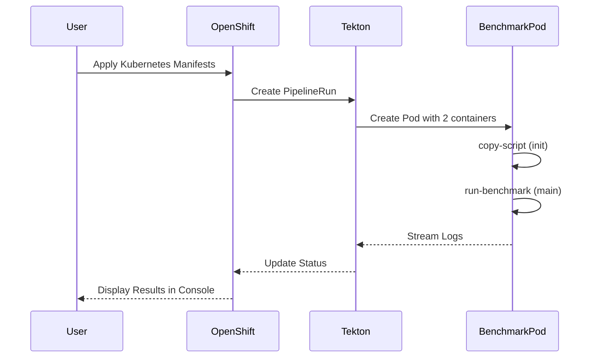

# Pipeline CPU Performance Benchmark

This repository contains OpenShift/Kubernetes resources to run a CPU performance benchmark using a Tekton pipeline. The benchmark measures matrix multiplication performance and reports metrics like execution time and operations per second.

## 📋 Prerequisites

- OpenShift 4.x+ or Kubernetes 1.24+ cluster
- Tekton Pipelines v0.40.0+ installed
- `oc` or `kubectl` CLI configured
- Cluster admin privileges (for namespace creation)
- 2 vCPUs and 4GB RAM available for benchmark tasks

## 🚀 Quick Start

```bash
git clone https://github.com/BabbarPB08/pipeline-pref.git
cd pipeline-pref
oc apply -k cpu-perf-tester/ns/.
oc apply -k cpu-perf-tester/resources/.
```

## 🔍 Monitoring Results

1. Access the OpenShift Console
2. Navigate to: **Pipelines** → **PipelineRuns**
3. Select the latest run
4. View logs under the `run-benchmark` task

## 📊 Expected Output

```plaintext
[2025-06-10 20:08:04] === Benchmark Script Start ===
[2025-06-10 20:08:04] Benchmark Result:
+------------------+----------------------+
| Matrix Size      | 1000 x 1000          |
+------------------+----------------------+
| Time Taken (sec) | 0.02                 |
+------------------+----------------------+
| Speed            | 46662.48 MegaOps/sec |
+------------------+----------------------+
System C-State Info: 9
```

## 🔄 Workflow Diagram



## 🧩 Benchmark Details

### Test Methodology
- Uses Python NumPy for matrix operations
- 1000×1000 floating-point matrices
- Measures:
  - Pure computation time (excluding I/O)
  - Floating-point operations per second
  - System power state (C-State)

### Performance Metrics
| Metric               | Description                          |
|----------------------|--------------------------------------|
| Matrix Size          | Dimension of test matrices           |
| Time Taken           | Wall-clock execution time (seconds)  |
| MegaOps/sec          | Millions of operations per second    |
| C-State              | CPU power saving state (0-9)         |

## 📂 Repository Structure

```
cpu-perf-tester/
├── ns/
│   ├── kustomization.yaml
│   └── namespace.yaml
└── resources/
    ├── pipeline.yaml
    ├── task-copy-script.yaml
    ├── task-run-benchmark.yaml
    └── kustomization.yaml
```

## 📜 License

MIT License

```text
Copyright (c) 2024 Bharat Babbar

Permission is hereby granted, free of charge, to any person obtaining a copy
of this software and associated documentation files (the "Software"), to deal
in the Software without restriction, including without limitation the rights
to use, copy, modify, merge, publish, distribute, sublicense, and/or sell
copies of the Software, and to permit persons to whom the Software is
furnished to do so, subject to the following conditions:

The above copyright notice and this permission notice shall be included in all
copies or substantial portions of the Software.

THE SOFTWARE IS PROVIDED "AS IS", WITHOUT WARRANTY OF ANY KIND, EXPRESS OR
IMPLIED, INCLUDING BUT NOT LIMITED TO THE WARRANTIES OF MERCHANTABILITY,
FITNESS FOR A PARTICULAR PURPOSE AND NONINFRINGEMENT. IN NO EVENT SHALL THE
AUTHORS OR COPYRIGHT HOLDERS BE LIABLE FOR ANY CLAIM, DAMAGES OR OTHER
LIABILITY, WHETHER IN AN ACTION OF CONTRACT, TORT OR OTHERWISE, ARISING FROM,
OUT OF OR IN CONNECTION WITH THE SOFTWARE OR THE USE OR OTHER DEALINGS IN THE
SOFTWARE.
```

## 🤝 Contributing

1. Fork the repository
2. Create a feature branch (`git checkout -b feature/improvement`)
3. Commit changes (`git commit -am 'Add new feature'`)
4. Push to branch (`git push origin feature/improvement`)
5. Open a Pull Request

